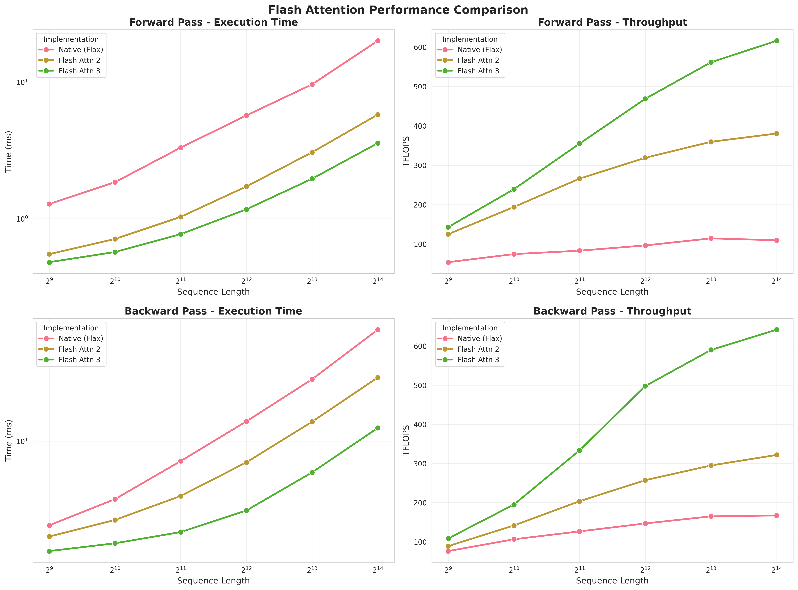
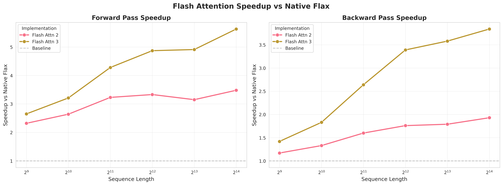

# FlashAttention3 for JAX

This library provides JAX bindings of [FlashAttention 3](https://github.com/Dao-AILab/flash-attention) with support for:
- Multi-Query Attention and Grouped-Query Attention
- Causal masking and sliding window attention
- Ring Attention
- Variable length sequences within batches

## Requirements

- **CUDA**: 12.3 or higher
- **OS**: Linux
- **JAX**: >= 0.5.0 and <= 0.7.0
  - Version 0.5.0+ required for the new FFI custom call API
  - Version 0.7.0 limit due to XLA changes affecting ring attention (0.7.1 disabled mixed-precision collective permute operations)
  - Higher JAX versions may work if you don't use ring attention

**Note**: bindings have only been tested on Hopper architecture.

## Installation

### Building from Source

Currently, only source builds are available. Use the `uv` build system:

```bash
# Basic build
uv build --wheel

# Parallel build
CMAKE_BUILD_PARALLEL_LEVEL=32 uv build --wheel

# Install the wheel
pip install dist/flash_attn3_jax_*.whl
```

#### Advanced Build Options

Advances build options are available, see default values in the `pyproject.toml`:

```bash
# Target specific GPU architectures
FLASH_ATTN_CUDA_ARCHS="80;90" uv build --wheel
```

## Quick Start

```python
import jax.numpy as jnp
from flash_attn3_jax import flash_mha

# Inputs with dimensions (batch, seqlen, num_heads, head_dim)
q = jnp.ones((2, 1024, 32, 128), dtype=jnp.float16)
k = jnp.ones((2, 1024, 32, 128), dtype=jnp.float16)
v = jnp.ones((2, 1024, 32, 128), dtype=jnp.float16)

output = flash_mha(q, k, v)

# Causal attn
output = flash_mha(q, k, v, is_causal=True)

# Sliding window attn
output = flash_mha(q, k, v, window_size=(256, 256))
```

## API Reference

### `flash_mha`

Main function for flash attention with fixed length sequences.

```python
flash_mha(
    q,                      # (b, l, h_q, d)
    k,                      # (b, l, h_k, d)
    v,                      # (b, l, h_k, d)
    softmax_scale=None,     # default to 1/sqrt(d)
    is_causal=False,
    window_size=(-1, -1)
)
```

MQA and GQA are automatically detected when `h_q != h_k` (`h_q` must be divisible by `h_k`).
For example, `q.shape = (b, l, 32, 128)`, `k.shape = (b, l, 8, 128)` => GQA with 4 groups

### `flash_mha_varlen`

Flash attention for variable length sequences within a batch.

```python
from flash_attn3_jax import flash_mha_varlen

flash_mha_varlen(
    q,                     # (total_q, h, d)
    k,                     # (total_k, h, d)
    v,                     # (total_k, h, d)
    cu_seqlens_q,          # Cumulative sequence lengths for Q (b+1,)
    cu_seqlens_k,          # Cumulative sequence lengths for K (b+1,)
    max_seqlen_q,          # Maximum sequence length in batch for Q
    max_seqlen_k,          # Maximum sequence length in batch for K
    softmax_scale=None,
    is_causal=False,
    window_size=(-1, -1)
)
```

Example:
```python
# Batch of 2 sequences: lengths [512, 1024], tot 1536
q = jnp.ones((512 + 1024, 32, 128), dtype=jnp.float16)
k = jnp.ones((512 + 1024, 32, 128), dtype=jnp.float16)
v = jnp.ones((512 + 1024, 32, 128), dtype=jnp.float16)

cu_seqlens = jnp.array([0, 512, 1536], dtype=jnp.int32)

output = flash_mha_varlen(
    q, k, v,
    cu_seqlens_q=cu_seqlens,
    cu_seqlens_k=cu_seqlens,
    max_seqlen_q=1024,
    max_seqlen_k=1024
)
```

### Ring Attention

When `flash_mha` detects that inputs are sharded along the sequence dimension, it automatically dispatches to ring attention:

```python
import jax
from jax.experimental import mesh_utils
from jax.sharding import Mesh, NamedSharding, PartitionSpec as P
from flash_attn3_jax import flash_mha

devices = mesh_utils.create_device_mesh((8,))
mesh = Mesh(devices, axis_names=('seq',))

# Shard along sequence dimension
sharding = NamedSharding(mesh, P(None, 'seq', None, None))
q_sharded = jax.device_put(q, sharding)
k_sharded = jax.device_put(k, sharding)
v_sharded = jax.device_put(v, sharding)
output = flash_mha(q_sharded, k_sharded, v_sharded)
```


For optimal performance, enable XLA's latency-hiding scheduler to overlap communication with computation:

```python
import os
os.environ["XLA_FLAGS"] = "--xla_gpu_enable_latency_hiding_scheduler=true"
# Must be set before importing JAX
import jax
```

## Benchmarks

### Forward Pass Comparison

| Batch | SeqLen | Native (Flax) |        | Flash Attn 2 |        | Flash Attn 3 |        | FA3 vs Flax | FA2 vs Flax |
|------:|-------:|--------------:|-------:|-------------:|-------:|-------------:|-------:|------------:|------------:|
|       |        | Time (ms)     | TFLOPS | Time (ms)    | TFLOPS | Time (ms)    | TFLOPS | Speedup     | Speedup     |
|    32 |    512 |          1.28 |   53.8 |         0.55 |  124.9 |         0.48 |  142.9 |       2.65x |       2.32x |
|    16 |  1,024 |          1.85 |   74.4 |         0.71 |  194.0 |         0.57 |  239.1 |       3.21x |       2.64x |
|     8 |  2,048 |          3.31 |   83.0 |         1.03 |  266.0 |         0.77 |  355.0 |       4.28x |       3.23x |
|     4 |  4,096 |          5.70 |   96.4 |         1.72 |  319.0 |         1.17 |  468.9 |       4.87x |       3.33x |
|     2 |  8,192 |          9.62 |  114.3 |         3.06 |  359.6 |         1.96 |  561.6 |       4.91x |       3.15x |
|     1 | 16,384 |         20.07 |  109.5 |         5.78 |  380.6 |         3.57 |  616.2 |       5.63x |       3.48x |


### Backward Pass Comparison


| Batch | SeqLen | Native (Flax) |        | Flash Attn 2 |        | Flash Attn 3 |        | FA3 vs Flax | FA2 vs Flax |
|------:|-------:|--------------:|-------:|-------------:|-------:|-------------:|-------:|------------:|------------:|
|       |        | Time (ms)     | TFLOPS | Time (ms)    | TFLOPS | Time (ms)    | TFLOPS | Speedup     | Speedup     |
|    32 |    512 |          3.16 |   76.2 |         2.71 |   88.9 |         2.22 |  108.5 |       1.42x |       1.17x |
|    16 |  1,024 |          4.52 |  106.3 |         3.40 |  141.6 |         2.47 |  195.0 |       1.83x |       1.33x |
|     8 |  2,048 |          7.61 |  126.5 |         4.72 |  203.6 |         2.88 |  333.6 |       2.64x |       1.60x |
|     4 |  4,096 |         13.11 |  146.8 |         7.48 |  257.3 |         3.87 |  497.8 |       3.39x |       1.76x |
|     2 |  8,192 |         23.34 |  164.9 |        13.05 |  294.9 |         6.52 |  590.0 |       3.58x |       1.79x |
|     1 | 16,384 |         46.05 |  167.2 |        23.92 |  321.8 |        11.99 |  641.8 |       3.84x |       1.93x |


Log2 is applied for sequence length and time axis to ease seing the trends across all configuations equally.


## Credits

This project is based on the official FlashAttention implementation [FlashAttention repository](https://github.com/Dao-AILab/flash-attention).
It is also heavily inspired by [FlashAttention 2 implementation for JAX](https://github.com/nshepperd/flash_attn_jax).
